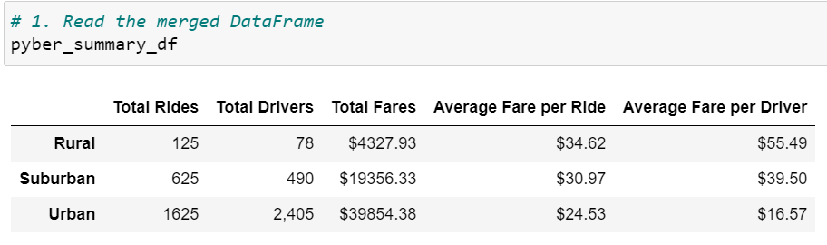
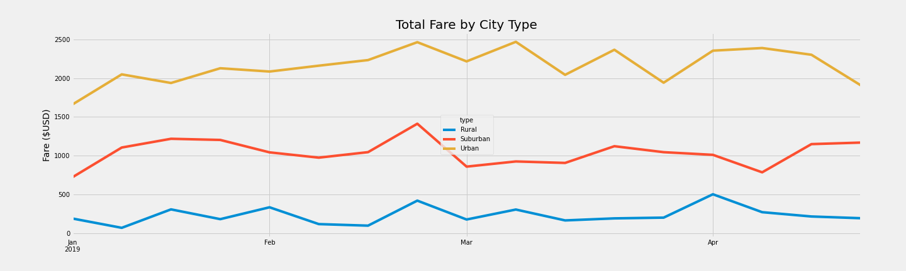

# PyBer_Analysis

## Overview of the analysis
The purpose of the project is to create a summary dataframe of the ride-sharing data by city type as well as a multiple-line graph that shows the total weekly fares for each city type by analyzing the ride data and city data using Pandas and Matplotlib. Decision-makers at Pyber may make decisions based on how the data differs by city type through the analysis report.

## Results
After conducting an analysis on the ride and city data, the summary of the PyBer data is as follows:

As shown in the figure above, the "Urban" city type has the highest number of total rides, total drivers, and total fares, while it has the lowest average fare per ride and average fare per driver. On the other hand, the "Rural" city type has the lowest number of total rides, total drivers, and total fares, but it has the highest average fare per ride and average fare per driver. Meanwhile, the "Suburban" city type is in the middle ground for all categories.

By grouping the data by "city type" and "date", a new figure is created to visualize an analysis on the weekly fare by city type from 1st Jan, 2019 to the end of 27th Apr, 2019.

As shown in the figure above, the "Urban" city type has the highest weekly fare, while the "Rural" city type has the lowest weekly fare throughout the time period.

## Summary
Based on the results, there are three business recommendations for addressing the disparities among the city types.

1. Although the data is fairly informative, an additional piece of data could be added to make it more comprehensive. From the "Average Fare per Ride" data, it is shown that the "Rural" city type has the highest average fare. This might be due to the longer distance or duration for each ride in rural cities. Therefore, adding the duration of each ride to the dataset is recommended. The average duration per ride  for each city type can then be calculated by dividing the total duration for each ride by total number of rides. By doing so, this new insight may be useful when making decisions such as making adjustments on fares.

2. As shown in the "Total Fare by City Type" figure, although the total fare in rural cities are very low, the average fare per ride and average fare per driver are the highest. This indicates that if there are more total rides, the profit in rural cities can be maximized. To create demand, it is recommended that the fare for rural cities are lowered to encourage rural citizens take use PyBer service.

3. On the other hand, urban cities has the highest number of rides but the lowest average fare. This could also be contributed by the highest number of total drivers in urban cities. Assuming travel distances are short in urban cities, a higher base fare can be set to maximize profit per ride. To offset or prevent backlash from customers due to increased fare, a discount package can be offered as such: for every 10 ride a customer take, there will be 1 ride offered with 25% discount. This not only serves as an incentive for customers to use PyBer's service, but also encourage them to use the offer on a ride with longer distance as well.